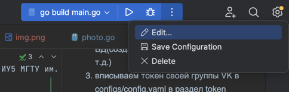
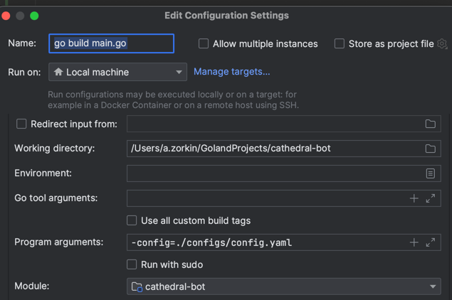

# cathedral-bot
Это проект, реализует фотоархив и документоархив для кафедры ИУ5 МГТУ им. Баумана.

# Как запустить проект?
1. docker-compose up -d - поднимем PostgreSQL
2. make migrate - выполним миграции в БД(создадим нужные сущности и т.д.). 
Возможно, будет крашиться, если не установлен goose. Чтобы установить, читай доку - https://github.com/pressly/goose
3. вписываем токен своей группы VK в configs/config.yaml в раздел token
4. make run - запускаем проект

# Я хочу подебажить, как?
1. Переходим по вкладке Edit:

2. Нужно прописать в Program arguments cледующее: -config=./configs/config.yaml

3. Пробуйте запускаться в режиме дебаг

# Хочу добавить новые миграции, как?
1. Читаем доку - https://github.com/pressly/goose
2. Вкратце, переходим в папку migrations и, если goose уже установлен, то выполняй в консоли: goose create new_table sql